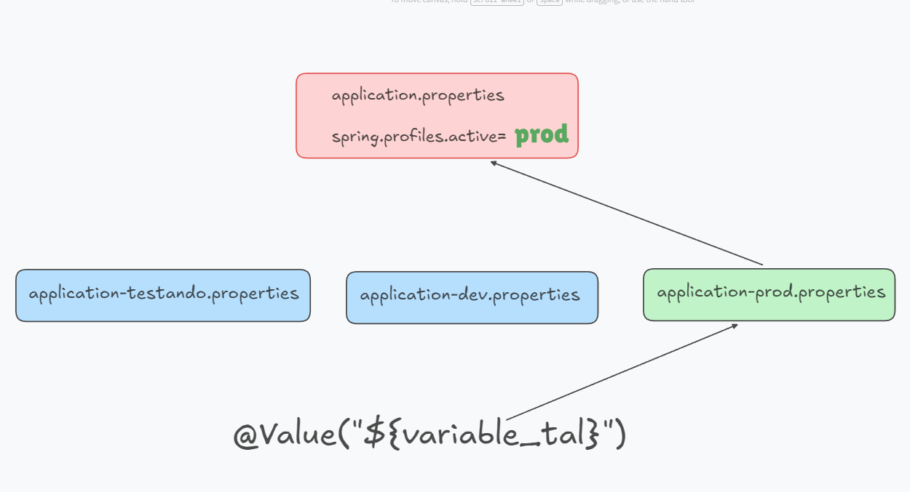
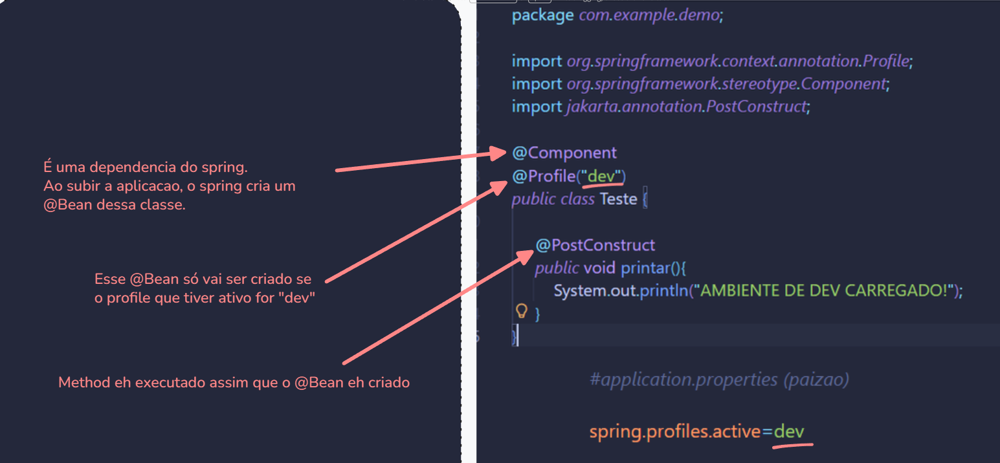

<h1 align="center">
     <span>@Profile</span>
</h1>


Quando estamos trabalhando em vários ambientes diferentes, por exemplo no nosso ambiente local e um ambiente na nuvem, precisamos de configurações difentes.

Como já vimos antes, o arquivo que colocamos nossas configs de banco de dados, setamos a porta do servidor, e todas as configs do spring,  é no arquivo `aplication.properties`.


<hr>
<br>

## Padrao de nomenclatura dos arquivos aplication.properties

Para criar arquivos de configuração no Spring Boot, é importante seguir o padrão de nomenclatura:

- `aplication-ambientedev.properties`
- `aplication-ambienteproducao.properties`
- `aplication-ambientetal.properties`
- `etc...`


<br>

Normalmente, numa empresa usamos assim:

- `application-dev.properties` → desenvolvimento
- `application-qa.properties` → homologação/testes
- `application-prod.properties` → produção

<hr>
<br>

## Setando o profile que vamos usar


Para setar o arquivo de config propertis correto, precisamos ir lá no arquivo applicatoni.properties "pai" e setar:

```properties
#application.properties pai de todas / padraozin
spring.profiles.active=dev
```

<br>

Assim, todos os `@Value("${}")` da sua aplicação vão buscar os valores do arquivo **application-dev.properties**.

<br>
<br>

Podemos setar o `spring.profiles.active` só na hora de criar o .jar:

```bash
mvn spring-boot:run -Dspring-boot.run.profiles=dev
```

<hr>
<br>

## Entendendo a hierarquia dos application.properties


 


<br>

No Spring Boot, a aplicação procura primeiro no profile ativo e, se não encontrar, recorre ao arquivo pai:

1. application-prod.properties → primeiro lugar onde o Spring busca

2. application.properties → usado como fallback se a variável não existir no profile

<hr>
<br>

## @Profile

 

Usamos `@Profile` na classe para dizer que o bean só deve ser criado se um determinado profile estiver ativo.

<br>
<br>

### Colocando @Profile em methods específicos

```java
@Profile("devaws") //esse bean so vai ser criado se esse profile tiver ativo
@Bean
public S3Client generateS3ClientProducao(@Value("${aws_region}") String region){ //esse @Value vai procurar sempre no profile que tiver ativo
     return S3Client.builder()
          .region(Region.of(region))
          .credentialsProvider(DefaultCredentialsProvider.builder().build()) 
          .build();
}
```